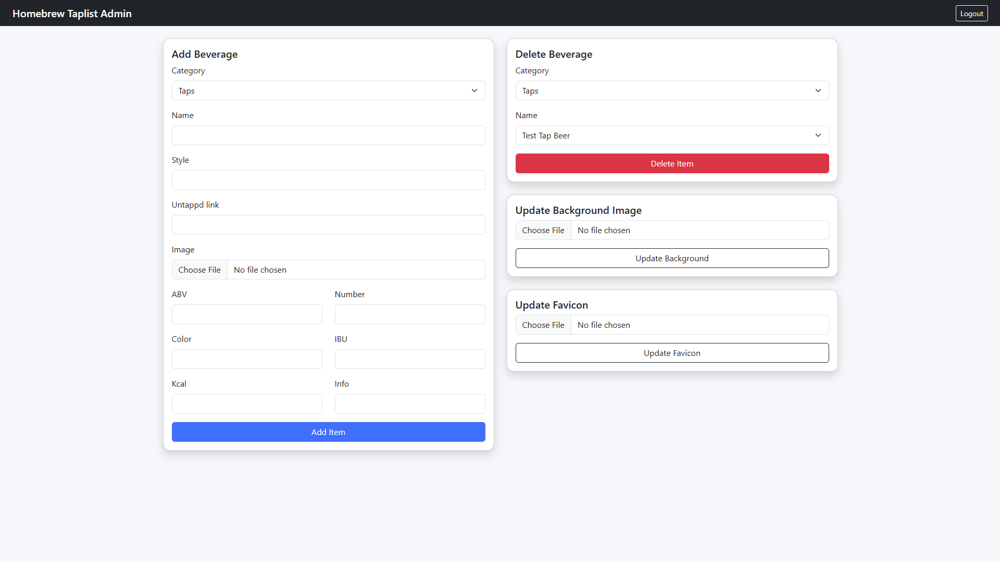

# Homebrew Taplist

## Description
I created this application to have a nice looking taplist at home for my guests. As this is only intended for usage on a home network there is no real security to speak of. This also shows in the application using HTTP and environment variables to configure the `secret key` and `admin credentials`. The site can be configured using the admin page. Here beverages can be added or removed, while the favicon and the background image can also be updated.

## Environment Variables
These environment variables are used for configuration.
- **ADMIN_USER**: The name of the admin user. Default value is admin.
- **ADMIN_PASS**: The password of the admin user. Default value is password.
- **SECRET_KEY**: The flask session secret key.

## Beverage Attributes
These are the attributes that can be configured for all the beverages.
- **number**: Sets the number for the beer. It can show the tap number the beers is on or the number on top of the bottle cap. This is also used to order the beverages. For spirits this value is not shown. 
- **color**: The color of the beer in SRM value. The beer cards color will be set to this color, if no color is set then the default grey `#808080` one will be used.
- **abv**: The alcohol by volume value.
- **ibu**: Bitterness of the beer, ignored for spirits.
- **image**: Path of the image file for intended use should start with `/mount/`, however I intentionally left it to full path for more flexibility.
- **name**: Name of the beverage.
- **style**: Style of the beverage.
- **kcal**: Calories for 100ml of the beverage.
- **untappd**: Link to the Untappd page of the beverage.

## Usage
I would recommend using the already published [docker image](https://hub.docker.com/repository/docker/kreutzakos/homebrew-taplist). When running this image, the only thing to ensure is that the mount folder is mounted so the custom images and json file can be read by the application. This also allows updating the taplist without any need to restart or rebuild the image.

```
docker run -p 80:80 --rm -v [PATH_TO_MOUNT_FOLDER]:/app/mount e ADMIN_USER=[ADMIN_USERNAME] -e ADMIN_PASS=[ADMIN_PASSWORD] -e SECRET_KEY=[SECRET_KEY] kreutzakos/taplist:latest
```

## Example
### Admin Page

<p align="left">
  </img>
</p>

### Desktop

<p align="left">
  </img>
</p>

### Mobile

<p align="left">
  </img>
</p>
