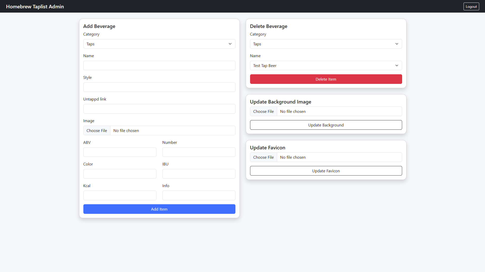

# Homebrew Taplist

## Description
I created this application to have a nice looking taplist at home for my guests. It is intended for usage on a home network, but it is still hardened: CSRF protection, login rate limiting, validated uploads, security headers and a minimal, non-root, read-only capable container. See the [Changelog](Changelog.md) for details. The site can be configured using the admin page. Here beverages can be added or removed, while the favicon and the background image can also be updated.

## Upgrading from 1.x
Version 2.0 contains breaking changes: required secrets, port `8080` instead of `80`, a non-root user (the mount folder must be owned by UID `10001`) and a container image without a shell. See the [Changelog](Changelog.md#breaking-changes) before upgrading.

## Environment Variables
These environment variables are used for configuration. The application refuses to start if `SECRET_KEY` or the admin password is missing or left at an insecure default.
- **ADMIN_USER**: The name of the admin user. Default value is admin.
- **ADMIN_PASS**: The password of the admin user. **Required** unless `ADMIN_PASS_HASH` is set.
- **ADMIN_PASS_HASH**: Optional pre-hashed admin password (takes precedence over `ADMIN_PASS`). Generate it with `python -c "from werkzeug.security import generate_password_hash; print(generate_password_hash('YOUR_PASSWORD'))"`.
- **SECRET_KEY**: The flask session secret key. **Required**, at least 32 characters. Generate one with `python -c "import secrets; print(secrets.token_hex(32))"`.
- **SESSION_COOKIE_SECURE**: Set to `true` when the site is served over HTTPS (e.g. behind a TLS reverse proxy) so the session cookie is only sent over encrypted connections. Default value is false.
- **SESSION_LIFETIME_HOURS**: How long an admin login stays valid. Default value is 8.
- **TRUSTED_PROXIES**: Number of reverse proxies in front of the app (e.g. `1` behind Caddy/Traefik/nginx). Needed so the login rate limit sees the real client IP instead of the proxy's. Only set it when a proxy is actually in front, otherwise clients can spoof their IP. Default value is 0.

Every secret can also be read from a file by appending `_FILE` to its name (e.g. `SECRET_KEY_FILE=/run/secrets/taplist_secret_key`), which works well with Docker secrets.

## Beverage Attributes
These are the attributes that can be configured for all the beverages. Values entered on the admin page are validated, and the allowed ranges are shown in brackets.
- **number**: Sets the number for the beer. It can show the tap number the beers is on or the number on top of the bottle cap. This is also used to order the beverages. For spirits this value is not shown. Required for taps; adding a tap with an existing number replaces that tap. [0–99999]
- **color**: The color of the beer in SRM value. The beer cards color will be set to this color, if no color is set then the default grey `#333333` one will be used. When editing `drinks.json` by hand a hex color (`#rrggbb`) can also be given. [0–50]
- **abv**: The alcohol by volume value. [0–100]
- **ibu**: Bitterness of the beer, ignored for spirits. [0–1000]
- **image**: Path of the image file for intended use should start with `/mount/`, however I intentionally left it to full path for more flexibility. Only image files (`.png`, `.jpg`, `.jpeg`, `.gif`, `.webp`) are served from `/mount`, and the admin page only ever deletes images under `/mount/img/`.
- **name**: Name of the beverage. [max. 200 characters]
- **style**: Style of the beverage. [max. 200 characters]
- **info**: Extra information shown on the card. [max. 1000 characters]
- **kcal**: Calories for 100ml of the beverage. [0–10000]
- **untappd**: Link to the Untappd page of the beverage. Must be an `untappd.com` link.

## Usage
I would recommend using the already published [docker image](https://hub.docker.com/repository/docker/kreutzakos/homebrew-taplist). When running this image, the only thing to ensure is that the mount folder is mounted so the custom images and json file can be read by the application. This also allows updating the taplist without any need to restart or rebuild the image.

The container runs as an unprivileged user (UID/GID `10001`) and listens on port **8080**. The mounted folder must be writable by that user:

```
sudo chown -R 10001:10001 [PATH_TO_MOUNT_FOLDER]
```

Put the configuration in an env file instead of passing passwords on the command line (keeps them out of your shell history), and restrict its permissions with `chmod 600 taplist.env`:

```
# taplist.env
ADMIN_USER=[ADMIN_USERNAME]
ADMIN_PASS=[ADMIN_PASSWORD]
SECRET_KEY=[SECRET_KEY]
```

Then run the container with the hardening flags (read-only filesystem, no Linux capabilities, resource limits). Prefer a version tag over `latest`, so an update never happens by surprise:

```
docker run -d --name taplist --restart unless-stopped \
  --read-only --tmpfs /tmp \
  --cap-drop ALL --security-opt no-new-privileges \
  --pids-limit 100 --memory 256m \
  --env-file taplist.env \
  -p 80:8080 \
  -v [PATH_TO_MOUNT_FOLDER]:/app/mount \
  kreutzakos/homebrew-taplist:[VERSION]
```

### Docker Compose with secrets
With Compose the secrets can be passed as files through the `_FILE` variables, so they don't show up in `docker inspect`. The secret files must be readable by UID `10001`.

```yaml
services:
  taplist:
    image: kreutzakos/homebrew-taplist:[VERSION]
    restart: unless-stopped
    read_only: true
    tmpfs: [/tmp]
    cap_drop: [ALL]
    security_opt: [no-new-privileges:true]
    pids_limit: 100
    mem_limit: 256m
    ports: ["80:8080"]
    volumes:
      - ./mount:/app/mount
    environment:
      ADMIN_USER: admin
      ADMIN_PASS_FILE: /run/secrets/admin_pass
      SECRET_KEY_FILE: /run/secrets/secret_key
    secrets: [admin_pass, secret_key]

secrets:
  admin_pass:
    file: ./secrets/admin_pass.txt
  secret_key:
    file: ./secrets/secret_key.txt
```

### HTTPS
The app itself speaks plain HTTP. Even on a home network it is worth putting a TLS reverse proxy in front of it, so the admin password and session cookie are never sent unencrypted. Example with [Caddy](https://caddyserver.com/) (uses its own local CA for `.lan`/`localhost` names, or Let's Encrypt for public domains):

```
# Caddyfile
taplist.lan {
    reverse_proxy taplist:8080
    header Strict-Transport-Security "max-age=31536000"
}
```

When running behind the proxy, set `SESSION_COOKIE_SECURE=true` and `TRUSTED_PROXIES=1`, and don't publish port 8080 of the app container to the network, only the proxy's port 443.

### Image variants
There are two container definitions in the repository:
- **Alpine** (`alpine.containerfile`, default, also used by `dockerfile`/`containerfile`): multi-stage build with only Python, the dependencies and the app in the final image. There is no shell, package manager or pip.
- **Debian** (`debian.containerfile`): based on `python:3.14-slim`, still non-root and hardened, but it keeps a shell and the Debian tools. Use it if you need them for troubleshooting or glibc compatibility.

Build a variant yourself with:

```
docker build -t homebrew-taplist:alpine .
docker build -f debian.containerfile -t homebrew-taplist:debian .
```

Both images have a `HEALTHCHECK`, so `docker ps` shows whether the app is healthy.

### Debugging
The Alpine image has no shell, so `docker exec -it taplist sh` does not work. Instead:
- Check the logs with `docker logs taplist`. Gunicorn writes every request to the log.
- Run Python inside the container, e.g. `docker exec taplist python3 -c "import os; print(os.listdir('/app/mount'))"`.
- Attach a temporary tool container that shares the app's processes and network: `docker run --rm -it --pid=container:taplist --network=container:taplist busybox`.
- Or run the Debian image, which has a shell.

## Development
Dependencies are listed in `requirements.in` and pinned with hashes in `requirements.txt`. After changing `requirements.in`, regenerate the pinned file with:

```
./generate_requirements.sh
```

The image installs with `pip --require-hashes`, so the build fails if `requirements.txt` is out of date or a package doesn't match its hash.

## Example
### Admin Page

<p align="left">
  </img>
</p>

### Desktop

<p align="left">
  </img>
</p>

### Mobile

<p align="left">
  </img>
</p>
